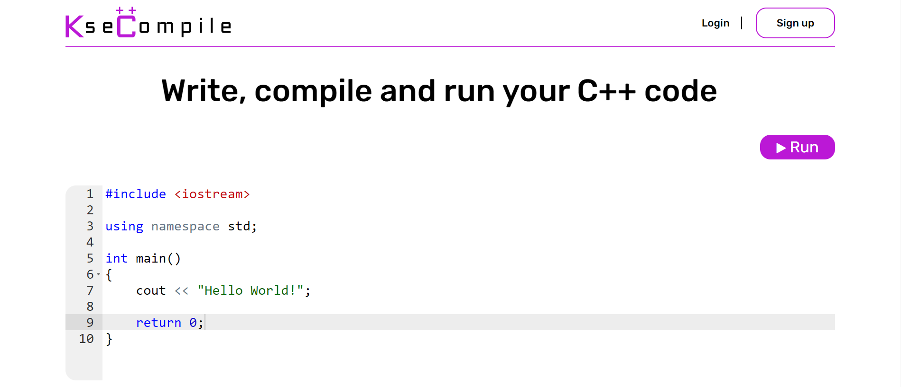
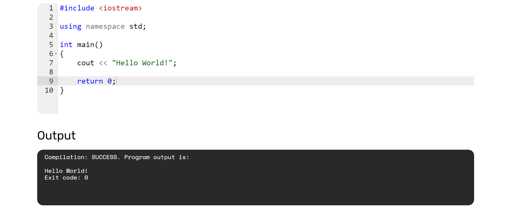

# KseCompile

### C++ Online Compiler

---

### KseCompile code editor:

&nbsp;

### Code compilation:

&nbsp;

---
The backend of the system is written in Python using Django.

The script in the JS language is responsible for compilation, as well as the Coliru service
